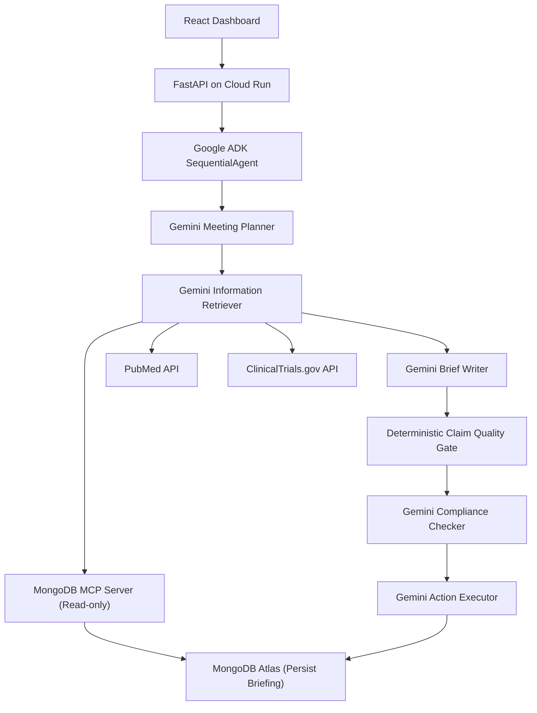

# PharmaOps Agent

**AI-Powered Meeting Prep for Pharma Sales Reps**

PharmaOps is an agentic workflow built with **Google ADK, Gemini, and MongoDB Atlas**. It automates the tedious, manual process of preparing for doctor meetings by retrieving evidence, checking compliance, and generating comprehensive briefing documents in seconds.

Built for the **Google Cloud Rapid Agent Hackathon (MongoDB Partner Track)**.

🔗 **Live Demo:** [https://pharmaops-agent-3xixawqfoq-uc.a.run.app/](https://pharmaops-agent-3xixawqfoq-uc.a.run.app/)

---

## 🛑 The Problem

Pharmaceutical sales reps spend 30 to 60 minutes preparing for a *single* meeting with a doctor. The process is painfully manual:
1. **Digging through CRMs** for past visit history and objections.
2. **Searching PubMed** and clinical trial databases for medical evidence.
3. **Cross-referencing competitive intelligence** on rival drugs.
4. **Writing talking points** and manually verifying them against strict pharmaceutical compliance rules (like UCPMP).

A rep with 5 meetings a day loses half their workday just on prep, and there's still a risk of non-compliant claims slipping through.

## ✨ Our Solution: PharmaOps Agent

PharmaOps Agent turns a 45-minute chore into a 30-second automated workflow. 

When a rep schedules a meeting in the dashboard, our multi-agent pipeline:
1. Analyzes the doctor's profile and CRM history.
2. Retrieves relevant internal company documents and competitive intelligence via **MongoDB Atlas Vector Search**.
3. Fetches live, external clinical evidence from the **PubMed** and **ClinicalTrials.gov** APIs.
4. Drafts a complete meeting briefing, including evidence-backed talking points and anticipated objections.
5. Runs a deterministic quality gate and a Gemini-powered **Compliance Checker** to ensure all claims meet promotional rules.

## 🏗️ Architecture & Tech Stack



* **Agent Orchestration**: Google Agent Development Kit (ADK) using `SequentialAgent`.
* **LLM**: Google Gemini.
* **Retrieval & Memory**: MongoDB Atlas (stores HCP profiles, CRM memory, drugs, compliance rules, vector embeddings).
* **MCP Integration**: Official MongoDB MCP server used to securely preflight database reads.
* **Frontend**: React.
* **Backend & Deployment**: FastAPI, deployed seamlessly on Google Cloud Run.

---

## 🚀 Setup & Local Development

### Required Environment Variables
You can configure these in a `.env` file or pass them directly:
```bash
MONGO_URI=mongodb+srv://...
MONGO_DB_NAME=pharmaops
GOOGLE_API_KEY=your_gemini_key
GOOGLE_LOCATION=us-central1
ENABLE_PARTNER_MCP=true
ENABLE_MONGODB_MCP=true
```

### 1. Seed the Database
Populate your MongoDB Atlas cluster with demo data and vector embeddings:
```bash
cd pharma-briefing-agent
pip install -r requirements.txt
python db/seed_data.py
python db/seed_mongodb_retrieval.py
```

### 2. Run the Backend
```bash
cd backend
python -m venv .venv
source .venv/bin/activate
pip install -r requirements.txt
uvicorn main:app --host 127.0.0.1 --port 8000
```

### 3. Run the Frontend
```bash
cd frontend
npm install
VITE_API_BASE_URL=http://127.0.0.1:8000 npm run dev
```

## ☁️ Deploy to Google Cloud Run

We provide an automated Cloud Build configuration (`cloudbuild.yaml`) that packages the React frontend and FastAPI backend into a single container.

```bash
# 1. Enable services
gcloud services enable run.googleapis.com cloudbuild.googleapis.com artifactregistry.googleapis.com secretmanager.googleapis.com

# 2. Create Artifact Registry
gcloud artifacts repositories create pharmaops --repository-format=docker --location=us-central1

# 3. Build & Deploy
gcloud builds submit --config cloudbuild.yaml --substitutions _REGION=us-central1,_SERVICE=pharmaops-agent
```

---

## 📜 License

This project is licensed under the MIT License - see the [LICENSE](LICENSE) file for details.
