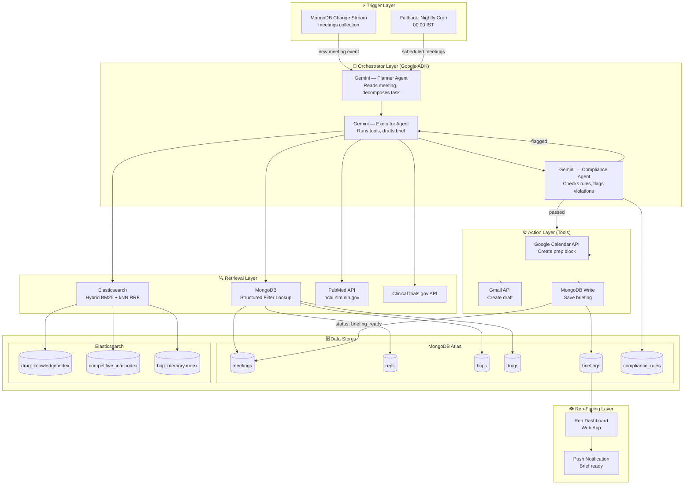
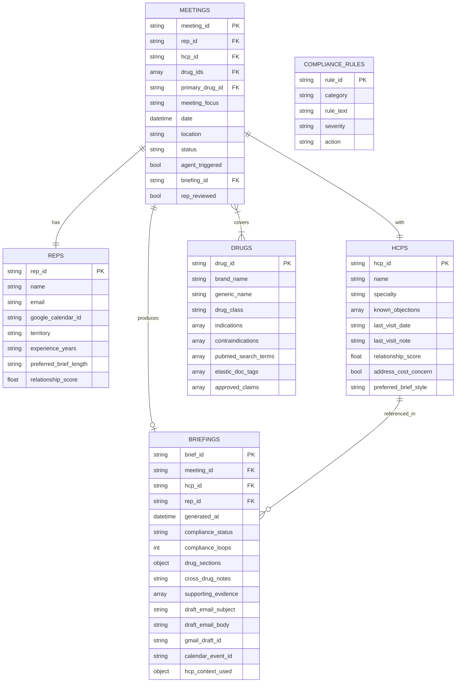
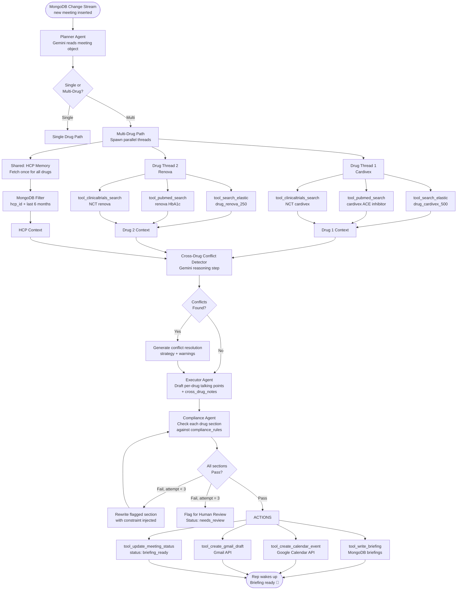
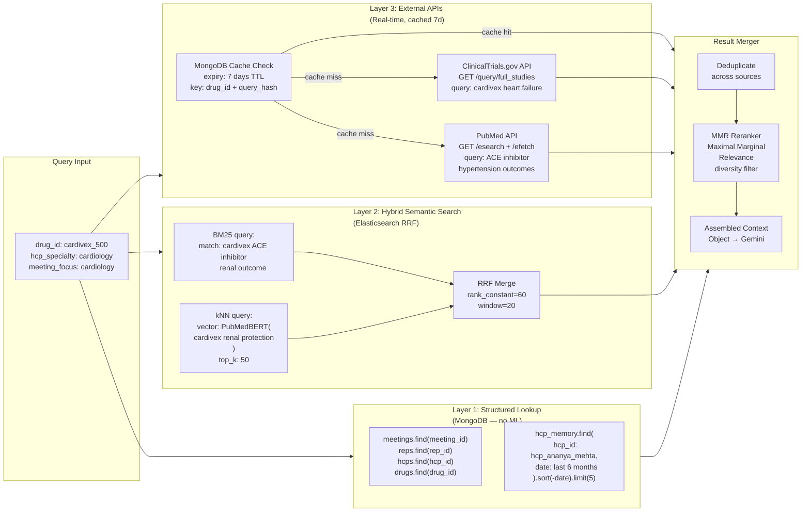
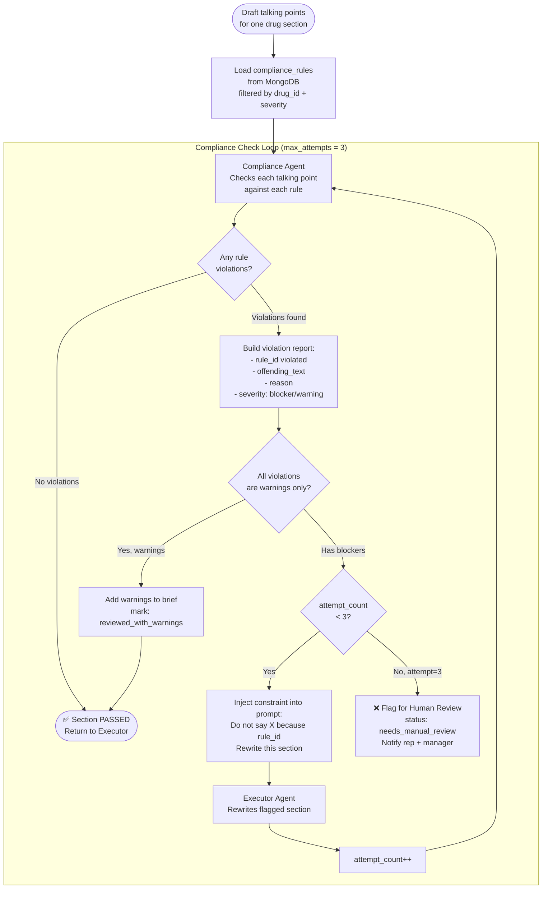
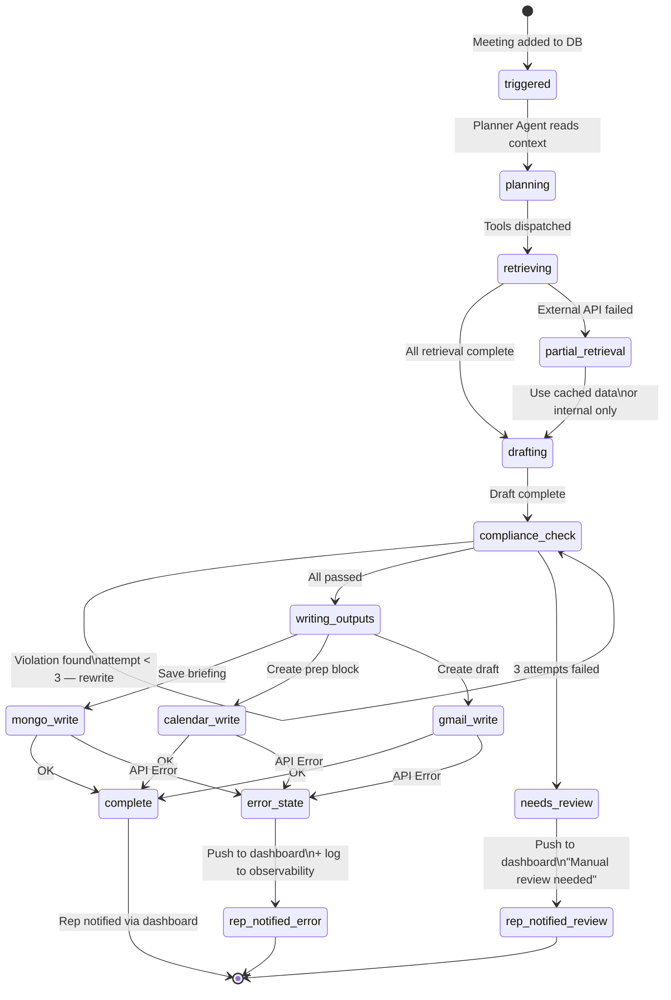

# Pharma Sales Rep AI Briefing Agent — Full System Design

---

## 1. High-Level Architecture



---

## 2. Complete Data Model (Low-Level Schema)

### MongoDB Collections



### Detailed Schema — Key Collections

```json
// meetings — full schema
{
  "_id": "mtg_001",
  "rep_id": "rep_rakesh_sharma",
  "hcp_id": "hcp_ananya_mehta",
  "drug_ids": ["drug_cardivex_500", "drug_renova_250"],
  "primary_drug_id": "drug_cardivex_500",
  "meeting_focus": "cardiology",
  "date": "2025-06-10T10:00:00",
  "location": "Kokilaben Hospital, Mumbai",
  "duration_mins": 15,
  "status": "scheduled | briefing_ready | completed",
  "agent_triggered": false,
  "briefing_id": null,
  "rep_reviewed": false,
  "created_at": "2025-06-09"
}

// briefings — full schema (multi-drug)
{
  "_id": "brief_mtg001",
  "meeting_id": "mtg_001",
  "hcp_id": "hcp_ananya_mehta",
  "rep_id": "rep_rakesh_sharma",
  "generated_at": "2025-06-09T02:14:00Z",
  "compliance_status": "passed",
  "compliance_loops": 2,
  "drug_sections": {
    "drug_cardivex_500": {
      "talking_points": ["Cardivex reduces systolic BP by 12mmHg (CARDIO-PROTECT, n=1200, p<0.001)"],
      "compliance_status": "passed",
      "compliance_loops": 2,
      "supporting_evidence": [
        {"source": "PubMed", "pmid": "38291045", "relevance": "Primary efficacy"},
        {"source": "ClinicalTrials", "nctId": "NCT05123456"}
      ]
    },
    "drug_renova_250": {
      "talking_points": ["Renova reduces HbA1c by 1.2% at 24 weeks (RENOVA-DIAB, n=800)"],
      "compliance_status": "passed",
      "compliance_loops": 1,
      "supporting_evidence": []
    }
  },
  "cross_drug_notes": "Lead with Cardivex on BP. Renova only if diabetes co-morbidity raised.",
  "cross_drug_conflict_flags": [],
  "draft_email_subject": "Follow-up: Cardivex + Renova data for Dr. Mehta",
  "draft_email_body": "Dear Dr. Mehta, ...",
  "gmail_draft_id": "gmail_draft_xyz789",
  "calendar_event_id": "google_cal_evt_abc123",
  "hcp_context_used": {
    "known_objections": ["cost-sensitive"],
    "last_visit_note": "Positive on renal data"
  }
}
```

### Elasticsearch Indices

```json
// Index: drug_knowledge
{
  "mappings": {
    "properties": {
      "doc_id":            { "type": "keyword" },
      "doc_type":          { "type": "keyword" },
      "drug_id":           { "type": "keyword" },
      "title":             { "type": "text", "analyzer": "medical_analyzer" },
      "content":           { "type": "text", "analyzer": "medical_analyzer" },
      "content_vector":    { "type": "dense_vector", "dims": 768 },
      "therapeutic_area":  { "type": "keyword" },
      "approved_date":     { "type": "date" },
      "tags":              { "type": "keyword" }
    }
  },
  "settings": {
    "analysis": {
      "analyzer": {
        "medical_analyzer": {
          "tokenizer": "standard",
          "filter": ["lowercase", "medical_synonyms"]
        }
      }
    }
  }
}

// Index: hcp_memory
{
  "mappings": {
    "properties": {
      "doc_id":           { "type": "keyword" },
      "hcp_id":           { "type": "keyword" },
      "rep_id":           { "type": "keyword" },
      "date":             { "type": "date" },
      "content":          { "type": "text" },
      "extracted_signals": {
        "properties": {
          "objections":         { "type": "keyword" },
          "positive_responses": { "type": "keyword" },
          "samples_requested":  { "type": "boolean" }
        }
      }
    }
  }
}
```

---

## 3. Agent Execution Flow — Detailed



---

## 4. Three-Layer Retrieval Pipeline (Low-Level)



---

## 5. Compliance Check Loop (Low-Level)



### Compliance Rules Schema (Low-Level)

```json
// compliance_rules collection
[
  {
    "rule_id": "rule_001",
    "category": "efficacy_claims",
    "rule_text": "All efficacy claims must cite a peer-reviewed study with n ≥ 500 participants.",
    "severity": "blocker",
    "action": "rewrite"
  },
  {
    "rule_id": "rule_002",
    "category": "comparative_claims",
    "rule_text": "Do not make comparative superiority claims unless a head-to-head trial is cited.",
    "severity": "blocker",
    "action": "rewrite"
  },
  {
    "rule_id": "rule_003",
    "category": "off_label",
    "rule_text": "Off-label indications must not be mentioned.",
    "severity": "blocker",
    "action": "remove"
  },
  {
    "rule_id": "rule_004",
    "category": "safety",
    "rule_text": "Safety and side-effect profile must be mentioned alongside efficacy.",
    "severity": "warning",
    "action": "append"
  },
  {
    "rule_id": "rule_005",
    "category": "absolute_claims",
    "rule_text": "No absolute claims: always, best, most effective.",
    "severity": "blocker",
    "action": "rewrite"
  }
]
```

---

## 6. Tool Function Signatures (Low-Level Design)

These are the exact tools the Gemini agent has access to:

```python
# --- RETRIEVAL TOOLS ---

def tool_search_elastic(
    drug_id: str,
    query: str,
    doc_types: list[str],         # ["drug_datasheet", "competitor_brief"]
    therapeutic_area: str,
    top_k: int = 10
) -> list[ElasticDocument]:
    """Hybrid BM25 + kNN search with RRF merge. Uses PubMedBERT embeddings."""

def tool_get_hcp_memory(
    hcp_id: str,
    rep_id: str,
    lookback_months: int = 6,
    limit: int = 5
) -> list[InteractionNote]:
    """Structured MongoDB filter — NOT semantic search. Returns most recent notes."""

def tool_pubmed_search(
    query: str,
    drug_id: str,
    max_results: int = 5,
    use_cache: bool = True,           # TTL: 7 days
    cache_key_hash: str = None
) -> list[PubMedArticle]:
    """Calls NCBI eSearch + eFetch. Extracts: title, abstract, pmid, pub_date."""

def tool_clinicaltrials_search(
    query: str,
    drug_id: str,
    max_results: int = 5,
    use_cache: bool = True
) -> list[ClinicalTrial]:
    """Calls ClinicalTrials.gov v2 API. Extracts: NCT ID, status, outcomes."""

# --- AGENT TOOLS ---

def tool_detect_cross_drug_conflicts(
    drug_contexts: dict[str, DrugContext],   # drug_id → retrieved context
    hcp_context: HCPContext
) -> CrossDrugConflictReport:
    """
    Gemini reasoning step. Detects:
    - Positioning conflicts (both drugs for same indication)
    - Clinical interaction conflicts (contraindicated co-prescription)
    - Compliance conflicts (off-label risk from combined context)
    Returns: conflict_flags[], resolution_strategy, conversation_order
    """

def tool_check_compliance(
    drug_id: str,
    talking_points: list[str],
    supporting_evidence: list[Evidence],
    attempt_number: int
) -> ComplianceResult:
    """
    Compliance Agent checks each point against compliance_rules.
    Returns: passed bool, violations[], rewrite_instructions
    """

# --- ACTION TOOLS ---

def tool_write_briefing(
    briefing: BriefingDocument
) -> str:
    """Writes to MongoDB briefings collection. Returns brief_id."""

def tool_update_meeting_status(
    meeting_id: str,
    status: str,                    # "briefing_ready" | "needs_review"
    briefing_id: str
) -> bool:
    """Patches meetings document."""

def tool_create_calendar_event(
    rep_calendar_id: str,
    meeting_datetime: datetime,
    hcp_name: str,
    brief_link: str
) -> str:
    """
    Creates 15-min prep block BEFORE meeting_datetime.
    Attaches brief link in description.
    Returns: google calendar event_id.
    """

def tool_create_gmail_draft(
    rep_email: str,
    hcp_email: str,
    subject: str,
    body: str,
    brief_link: str
) -> str:
    """Creates Gmail draft. Returns gmail_draft_id."""

def tool_notify_error(
    meeting_id: str,
    rep_id: str,
    stage: str,
    error_message: str
) -> None:
    """Push error to rep dashboard + optional Slack webhook. Never fails silently."""
```

---

## 7. Error Handling & Observability



### Observability Schema (Every Agent Step Logged)

```json
{
  "run_id": "run_20250609_mtg001",
  "meeting_id": "mtg_001",
  "start_time": "2025-06-09T02:00:00Z",
  "end_time": "2025-06-09T02:14:22Z",
  "total_duration_ms": 862000,
  "steps": [
    { "step": "planning",      "status": "ok", "duration_ms": 2100 },
    { "step": "elastic_search","status": "ok", "duration_ms": 340,  "docs_retrieved": 8 },
    { "step": "pubmed",        "status": "ok", "duration_ms": 1800, "articles": 3 },
    { "step": "clinicaltrials","status": "ok", "duration_ms": 2200, "trials": 2 },
    { "step": "cross_drug_conflict_check", "status": "ok", "conflicts_found": 0 },
    { "step": "drafting",      "status": "ok", "duration_ms": 4200 },
    { "step": "compliance_1",  "status": "fail","violations": ["rule_002"] },
    { "step": "compliance_2",  "status": "pass","duration_ms": 3100 },
    { "step": "mongo_write",   "status": "ok" },
    { "step": "calendar_write","status": "ok" },
    { "step": "gmail_write",   "status": "ok" }
  ],
  "final_status": "briefing_ready",
  "compliance_loops": 2,
  "drugs_covered": ["drug_cardivex_500", "drug_renova_250"]
}
```

---

## 8. Complete System At a Glance

```
INFRASTRUCTURE
├── MongoDB Atlas          → Operational store (structured data)
│   ├── meetings           → The trigger + status tracker
│   ├── reps               → Rep profile + Google credentials
│   ├── hcps               → Doctor profile + objections
│   ├── drugs              → Drug catalog + search hints
│   ├── briefings          → Agent output (written by agent)
│   └── compliance_rules   → FDA + company rules (read by agent)
│
├── Elasticsearch          → Knowledge retrieval (unstructured)
│   ├── drug_knowledge     → Drug datasheets, clinical summaries
│   ├── competitive_intel  → Competitor briefings
│   └── hcp_memory         → Past interaction notes
│
├── External APIs
│   ├── PubMed             → Latest clinical trial data
│   ├── ClinicalTrials.gov → Trial registry search
│   ├── Google Calendar    → Create prep events
│   └── Gmail              → Create draft emails
│
AGENT RUNTIME (Google ADK)
├── Planner Agent          → Reads meeting, decomposes task per drug
├── Executor Agent         → Calls tools, retrieves, drafts brief
└── Compliance Agent       → Self-checks output, loops until passed

RETRIEVAL STRATEGY
├── Structured data        → MongoDB filter (no ML needed)
├── Unstructured text      → Elastic BM25 + kNN RRF (PubMedBERT)
└── External literature    → Direct API + 7-day MongoDB cache

MULTI-DRUG ADDITION
├── Parallel retrieval per drug
├── Cross-drug conflict detection (positioning + clinical + compliance)
└── Unified brief with per-drug sections + cross_drug_notes

ERROR HANDLING
├── External API fails     → Use cache or internal-only mode
├── Compliance > 3 loops   → Escalate to human review
├── Action API fails       → Log + notify rep dashboard (never silent)
└── Full observability log → Every step duration + status
```
