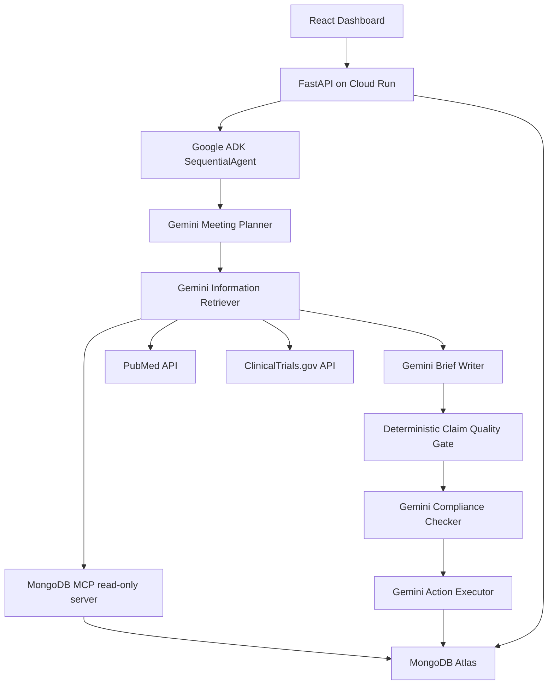

# PharmaOps MongoDB-Only System Design

## Architecture

## MongoDB Atlas Collections

- `meetings`: scheduled rep/HCP meetings and agent status.
- `sales_reps`: rep profile and territory context.
- `hcp_profiles`: doctor profile, practice context, objections, preferences.
- `drugs`: approved drug metadata and claims.
- `compliance_rules`: UCPMP and promotional review rules.
- `company_docs`: source-backed clinical documents and embedding vectors.
- `crm_memory`: historical rep/HCP interactions.
- `competitive_intel`: competitor context and embedding vectors.
- `briefings`: generated agent output.
- `agent_runs`: run results, errors, and tool trace snapshots.

## Retrieval Flow

1. Planner reads the meeting, HCP, rep, and drug context through MongoDB MCP.
2. Retriever queries MongoDB Atlas:
   - `company_docs` by `drug_id` plus hybrid text/vector relevance.
   - `crm_memory` by `hcp_id`, newest first.
   - `competitive_intel` by `therapeutic_area` plus hybrid text/vector relevance.
3. Retriever also queries PubMed and ClinicalTrials.gov for public evidence.
4. Evidence ledger normalizes MongoDB source IDs, PubMed PMIDs, and NCT IDs.
5. Quality gate blocks vague or mis-scoped claims before compliance review.
6. Action executor persists the final briefing and meeting status to MongoDB.

## Indexing

Normal MongoDB indexes support exact operational lookups on IDs, HCPs, dates,
drug IDs, therapeutic areas, and tags. Atlas Search/vector indexes support
semantic document retrieval over `company_docs` and `competitive_intel`.

## Demo Proof Points

- `/agent-runtime` shows ADK/Gemini/Cloud Run and live MongoDB MCP status.
- Tool trace shows MongoDB MCP preflight and collection reads.
- Briefing evidence cites MongoDB `company_docs` source metadata.
- No external private search service is required.
