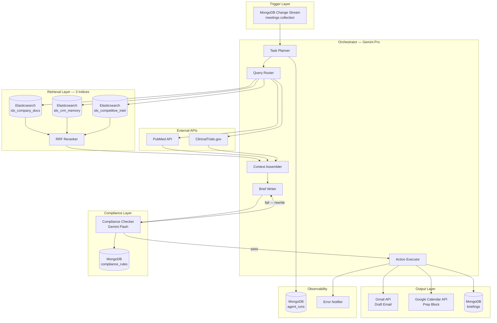
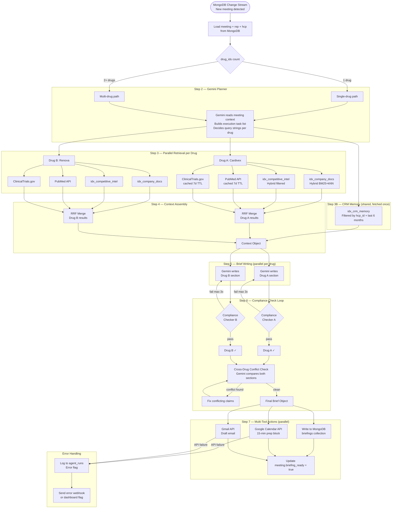

# Pharma AI Briefing Agent — Full System Design

---

## 1. High-Level Architecture



---

## 2. Database Schema — MongoDB

### Collection: `reps`
```json
{
  "_id": "rep_rakesh_sharma",
  "name": "Rakesh Sharma",
  "email": "rakesh@pharma.in",
  "google_calendar_id": "rakesh@pharma.in",
  "territory": "Mumbai West",
  "therapeutic_areas": ["cardiology", "nephrology"],
  "preferred_brief_length": "concise",
  "relationship_warmth": "neutral"
}
```

### Collection: `hcps`
```json
{
  "_id": "hcp_ananya_mehta",
  "name": "Dr. Ananya Mehta",
  "specialty": "Cardiology",
  "hospital": "Kokilaben Hospital, Mumbai",
  "prescribing_score": 8,
  "relationship_score": 7,
  "known_objections": ["cost-sensitive", "prefers-generics"],
  "preferred_drug_classes": ["ACE-inhibitor"],
  "last_visit_date": "2025-03-15",
  "address_objection": "cost"
}
```

### Collection: `meetings`
```json
{
  "_id": "mtg_001",
  "rep_id": "rep_rakesh_sharma",
  "hcp_id": "hcp_ananya_mehta",
  "date": "2025-06-10T10:00:00",
  "location": "Kokilaben Hospital, Mumbai",
  "drug_ids": ["drug_cardivex_500", "drug_renova_250"],
  "primary_drug_id": "drug_cardivex_500",
  "meeting_focus": "cardiology",
  "duration_mins": 20,
  "status": "scheduled",
  "agent_triggered": false,
  "briefing_id": null,
  "briefing_ready": false,
  "rep_reviewed": false
}
```
> **Trigger point**: `agent_triggered: false` + `status: scheduled` → Change Stream fires agent.

### Collection: `briefings`
```json
{
  "_id": "brief_mtg001_20250610",
  "meeting_id": "mtg_001",
  "rep_id": "rep_rakesh_sharma",
  "hcp_id": "hcp_ananya_mehta",
  "generated_at": "2025-06-09T02:14:00Z",
  "drug_sections": {
    "drug_cardivex_500": {
      "talking_points": ["Cardivex reduces systolic BP by avg 12mmHg..."],
      "supporting_evidence": [
        {"source": "PubMed", "pmid": "38291045", "relevance": "Primary efficacy"},
        {"source": "ClinicalTrials", "nctId": "NCT05123456"}
      ],
      "compliance_status": "passed",
      "compliance_loops": 2
    },
    "drug_renova_250": {
      "talking_points": ["Renova shown to reduce hospitalization by 18%..."],
      "supporting_evidence": [...],
      "compliance_status": "passed",
      "compliance_loops": 1
    }
  },
  "cross_drug_notes": "Lead with Cardivex on renal benefit. Introduce Renova as adjunct for HF.",
  "cross_drug_conflict_flags": [],
  "hcp_context_used": {
    "known_objections": ["cost-sensitive"],
    "last_visit_note": "Positive on renal data"
  },
  "draft_email_subject": "Follow-up on Cardivex + Renova — trial data enclosed",
  "draft_email_body": "Dear Dr. Mehta...",
  "gmail_draft_id": "gmail_draft_xyz",
  "calendar_event_id": "gcal_evt_abc",
  "personalization_flags": {
    "address_objection": "cost",
    "india_trial": true,
    "tone": "warm"
  }
}
```

### Collection: `compliance_rules`
```json
{
  "_id": "rule_001",
  "category": "efficacy_claims",
  "rule_text": "All efficacy claims must cite a peer-reviewed study with n >= 300 participants.",
  "severity": "blocker",
  "drug_ids": null
},
{
  "_id": "rule_002",
  "category": "comparative_claims",
  "rule_text": "Do not make comparative superiority claims unless backed by head-to-head trial.",
  "severity": "blocker"
},
{
  "_id": "rule_003",
  "category": "off_label",
  "rule_text": "Off-label indications must not be mentioned.",
  "severity": "blocker"
},
{
  "_id": "rule_004",
  "category": "safety",
  "rule_text": "Safety and side-effect profile must be mentioned alongside benefits.",
  "severity": "required"
},
{
  "_id": "rule_005",
  "category": "absolute_claims",
  "rule_text": "No absolute claims: always, best, most effective.",
  "severity": "blocker"
}
```

### Collection: `agent_runs`
```json
{
  "_id": "run_mtg001_20250609",
  "meeting_id": "mtg_001",
  "started_at": "2025-06-09T02:00:00Z",
  "completed_at": "2025-06-09T02:14:22Z",
  "status": "success",
  "steps": [
    {"step": "plan", "duration_ms": 1200, "status": "ok"},
    {"step": "retrieve_company_docs", "duration_ms": 890, "status": "ok"},
    {"step": "retrieve_crm_memory", "duration_ms": 120, "status": "ok"},
    {"step": "retrieve_competitive_intel", "duration_ms": 650, "status": "ok"},
    {"step": "fetch_pubmed", "duration_ms": 2100, "status": "ok"},
    {"step": "fetch_clinicaltrials", "duration_ms": 1800, "status": "ok"},
    {"step": "write_brief_drug1", "duration_ms": 3200, "status": "ok"},
    {"step": "compliance_check_drug1", "duration_ms": 1500, "status": "ok", "loops": 2},
    {"step": "write_brief_drug2", "duration_ms": 2800, "status": "ok"},
    {"step": "compliance_check_drug2", "duration_ms": 900, "status": "ok", "loops": 1},
    {"step": "cross_drug_check", "duration_ms": 1100, "status": "ok"},
    {"step": "action_mongodb", "duration_ms": 200, "status": "ok"},
    {"step": "action_calendar", "duration_ms": 450, "status": "ok"},
    {"step": "action_gmail", "duration_ms": 380, "status": "ok"}
  ],
  "error": null,
  "total_tokens_used": 24800,
  "compliance_loops_total": 3
}
```

### Collection: `drugs`
```json
{
  "_id": "drug_cardivex_500",
  "brand_name": "Cardivex 500",
  "generic_name": "Cardiomide",
  "drug_class": "ACE inhibitor",
  "indications": ["hypertension", "heart failure", "post-MI"],
  "contraindications": ["pregnancy", "bilateral renal artery stenosis"],
  "dosing": "500mg once daily",
  "pubmed_search_term": "ACE inhibitor hypertension outcomes cardioprotective",
  "clinicaltrials_tags": ["ACE-inhibitor", "cardioprotective"],
  "approved_claims": ["rule_001", "rule_004"],
  "elastic_doc_tags": ["cardivex", "ace-inhibitor"]
}
```

---

## 3. Elasticsearch — Three Index Schemas

### Index A: `idx_company_docs`
**Purpose:** Drug datasheets, clinical summaries, approved claim language, India-specific data  
**Retrieval strategy:** Hybrid BM25 + kNN with PubMedBERT embeddings

```json
// Mapping
{
  "mappings": {
    "properties": {
      "doc_id":           { "type": "keyword" },
      "doc_type":         { "type": "keyword" },
      "drug_id":          { "type": "keyword" },
      "therapeutic_area": { "type": "keyword" },
      "title":            { "type": "text", "analyzer": "english" },
      "content":          { "type": "text", "analyzer": "english" },
      "content_vector":   { "type": "dense_vector", "dims": 768, "index": true, "similarity": "cosine" },
      "approved_date":    { "type": "date" },
      "tags":             { "type": "keyword" },
      "india_specific":   { "type": "boolean" }
    }
  }
}
```

**Sample document:**
```json
{
  "doc_id": "doc_cardivex_datasheet",
  "doc_type": "drug_datasheet",
  "drug_id": "drug_cardivex_500",
  "therapeutic_area": "cardiology",
  "title": "Cardivex 500 — Full Clinical Data Summary",
  "content": "Cardivex 500 is indicated for treatment of hypertension...",
  "content_vector": [0.012, -0.834, ...],
  "approved_date": "2024-01-15",
  "tags": ["cardivex", "ace-inhibitor", "cardiology"],
  "india_specific": false
}
```

**Hybrid Query:**
```json
{
  "retriever": {
    "rrf": {
      "retrievers": [
        {
          "standard": {
            "query": {
              "bool": {
                "must": { "match": { "content": "{query_text}" }},
                "filter": { "term": { "drug_id": "{drug_id}" }}
              }
            }
          }
        },
        {
          "knn": {
            "field": "content_vector",
            "query_vector": "{pubmedbert_embedding}",
            "num_candidates": 50,
            "filter": { "term": { "drug_id": "{drug_id}" }}
          }
        }
      ],
      "rank_window_size": 20,
      "rank_constant": 60
    }
  },
  "size": 5
}
```

---

### Index B: `idx_crm_memory`
**Purpose:** Past visit interaction notes, rep observations, doctor responses  
**Retrieval strategy:** Structured filtered lookup only — NO vector search

```json
// Mapping
{
  "mappings": {
    "properties": {
      "doc_id":     { "type": "keyword" },
      "doc_type":   { "type": "keyword" },
      "hcp_id":     { "type": "keyword" },
      "rep_id":     { "type": "keyword" },
      "drug_ids":   { "type": "keyword" },
      "date":       { "type": "date" },
      "content":    { "type": "text" },
      "extracted_signals": {
        "type": "object",
        "properties": {
          "objections":          { "type": "keyword" },
          "positive_responses":  { "type": "keyword" },
          "samples_requested":   { "type": "boolean" },
          "follow_up_items":     { "type": "text" }
        }
      }
    }
  }
}
```

**Query (always structured — NEVER semantic):**
```json
{
  "query": {
    "bool": {
      "must": [
        { "term": { "hcp_id": "hcp_ananya_mehta" }},
        { "range": { "date": { "gte": "now-6M/M" }}}
      ]
    }
  },
  "sort": [{ "date": { "order": "desc" }}],
  "size": 5
}
```

> **Why no vectors here:** You always want the most *recent* notes for *this specific doctor*, not semantically similar notes from other doctors. PII is also isolated to this index for access control.

---

### Index C: `idx_competitive_intel`
**Purpose:** Competitor drug profiles, market positioning, objection responses  
**Retrieval strategy:** Hybrid BM25 + kNN filtered by therapeutic area

```json
// Mapping
{
  "mappings": {
    "properties": {
      "doc_id":             { "type": "keyword" },
      "doc_type":           { "type": "keyword" },
      "competitor_drug":    { "type": "keyword" },
      "therapeutic_area":   { "type": "keyword" },
      "our_drug_ids":       { "type": "keyword" },
      "content":            { "type": "text", "analyzer": "english" },
      "content_vector":     { "type": "dense_vector", "dims": 768, "index": true, "similarity": "cosine" },
      "weakness_tags":      { "type": "keyword" },
      "last_updated":       { "type": "date" }
    }
  }
}
```

**Query:**
```json
{
  "retriever": {
    "rrf": {
      "retrievers": [
        {
          "standard": {
            "query": {
              "bool": {
                "must": { "match": { "content": "{objection_text}" }},
                "filter": { "term": { "therapeutic_area": "cardiology" }}
              }
            }
          }
        },
        {
          "knn": {
            "field": "content_vector",
            "query_vector": "{embedding}",
            "num_candidates": 30,
            "filter": { "term": { "our_drug_ids": "{drug_id}" }}
          }
        }
      ],
      "rank_window_size": 10,
      "rank_constant": 60
    }
  },
  "size": 3
}
```

---

## 4. Agent Execution Flow (Step-by-Step)



---

## 5. Retrieval Pipeline — Detailed

```
INPUT: meeting context object
       {hcp_id, drug_ids[], meeting_focus, hcp.known_objections}

─────────────────────────────────────────────────────────────
STEP R1: Query Generation (Gemini)
─────────────────────────────────────────────────────────────
For each drug_id, Gemini generates:
  - company_doc_query:    "Cardivex ACE inhibitor renal outcomes efficacy"
  - competitive_query:    "Lisinopril weakness cost sensitivity once-daily"
  - pubmed_query:         "ACE inhibitor hypertension India population outcomes"
  - objection_angle:      "cost-sensitive patient India affordability"

─────────────────────────────────────────────────────────────
STEP R2: Parallel Retrieval (per drug + shared CRM)
─────────────────────────────────────────────────────────────

  [idx_company_docs]          → top 5 docs (hybrid RRF)
  [idx_competitive_intel]     → top 3 docs (hybrid RRF)
  [PubMed API]                → top 5 papers (check cache first)
  [ClinicalTrials.gov API]    → top 3 trials (check cache first)
  [idx_crm_memory]            → last 5 visits for this doctor (filter)

─────────────────────────────────────────────────────────────
STEP R3: Per-Source RRF Merge (Elastic built-in)
─────────────────────────────────────────────────────────────
Company docs results (BM25 rank + kNN rank) → RRF → top 5
Competitive results (BM25 rank + kNN rank)  → RRF → top 3

─────────────────────────────────────────────────────────────
STEP R4: Context Object Assembly
─────────────────────────────────────────────────────────────
{
  "hcp": { ...hcp profile, known_objections, relationship_score },
  "rep": { ...rep profile, preferred_brief_length },
  "drugs": [
    {
      "drug_id": "drug_cardivex_500",
      "company_docs": [...top 5 internal docs],
      "competitive_intel": [...top 3 competitor docs],
      "pubmed_papers": [...top 5 papers],
      "clinical_trials": [...top 3 trials]
    },
    {
      "drug_id": "drug_renova_250",
      ...same structure
    }
  ],
  "crm_memory": [...last 5 visit notes for this doctor],
  "compliance_rules": [...all active rules from MongoDB]
}

─────────────────────────────────────────────────────────────
STEP R5: Embedding Model
─────────────────────────────────────────────────────────────
Use: PubMedBERT (microsoft/BiomedNLP-PubMedBERT-base-uncased)
     or BioLinkBERT for cross-document linking

NOT: OpenAI text-embedding-ada (generic, misses clinical terms)

All documents pre-embedded at ingestion time.
Stored in content_vector field in Elastic.
```

---

## 6. Compliance Loop — Low-Level Design

```
MAX_REWRITE_ATTEMPTS = 3

loop:
  brief_section = gemini_write(drug, context)
  
  for attempt in range(MAX_REWRITE_ATTEMPTS):
    result = compliance_checker(brief_section, compliance_rules)
    
    if result.passed:
      break
    
    failed_rules = result.flags  
    # e.g. [{rule_id: "rule_001", offending_text: "Superior to Lisinopril",
    #         reason: "No head-to-head trial cited"}]
    
    brief_section = gemini_rewrite(
      original=brief_section,
      failed_rules=failed_rules,
      instruction="Fix only the flagged claims. Do not change passing sections."
    )
  
  if attempt == MAX_REWRITE_ATTEMPTS and not result.passed:
    # Human escalation — don't deliver incomplete brief
    mark_section_needs_review(drug_id)
    notify_rep("Brief for {drug} needs manual compliance review")
    # Still deliver other drug sections that passed

cross_drug_check:
  combined = merge_sections(all_passed_sections)
  conflicts = gemini_find_conflicts(combined)
  # Checks: contradictory BP claims, duplicate indications, dosing confusion
  if conflicts:
    resolve_conflicts(conflicts)
```

---

## 7. External API Layer

### PubMed
```
Endpoint:  https://eutils.ncbi.nlm.nih.gov/entrez/eutils/esearch.fcgi
Auth:      API key (10 req/sec limit)
Cache:     MongoDB collection `pubmed_cache`
           TTL index: 7 days on `fetched_at` field
Cache key: hash(drug_id + search_term + YYYY-WW)  ← weekly cache

Fields to extract: pmid, title, abstract, pub_date, authors, journal
```

### ClinicalTrials.gov
```
Endpoint:  https://clinicaltrials.gov/api/v2/studies
Params:    query.term, filter.overallStatus=COMPLETED, pageSize=5
Cache:     Same TTL cache strategy as PubMed
Fields:    nctId, briefTitle, phase, enrollment, primaryOutcome, startDate
```

### Gmail API
```
Action:    users.drafts.create
Payload:
  To:      hcp.email (if available) or templated
  Subject: from briefing.draft_email_subject
  Body:    from briefing.draft_email_body (HTML formatted)
  
Store:     gmail_draft_id in briefings collection
Fallback:  If API fails → log error, set meeting.gmail_status = "failed"
           → agent_runs logs error step
```

### Google Calendar API
```
Action:    events.insert
Payload:
  summary:     "⚡ Prep: Dr. {hcp.name} — {drug.brand_name} brief ready"
  start:       meeting.date - 15 minutes
  end:         meeting.date
  description: "Key points: {top_3_talking_points}\nFull brief: {dashboard_link}"
  
Store:     calendar_event_id in briefings collection
Fallback:  Same as Gmail — log, flag, don't crash entire run
```

---

## 8. Component Summary Table

| Component | Technology | Role |
|---|---|---|
| Trigger | MongoDB Change Stream | Fires agent on new scheduled meeting |
| Orchestrator | Gemini Pro | Plans, routes, assembles, writes |
| Compliance Checker | Gemini Flash (cheaper) | Rule validation loop |
| `idx_company_docs` | Elasticsearch | Drug KB — hybrid BM25+kNN |
| `idx_competitive_intel` | Elasticsearch | Competitor intel — hybrid BM25+kNN |
| `idx_crm_memory` | Elasticsearch | Doctor visit history — filtered lookup |
| Embedding Model | PubMedBERT (768d) | Clinical-aware dense vectors |
| PubMed Cache | MongoDB `pubmed_cache` | 7-day TTL cache for trial data |
| External APIs | PubMed + ClinicalTrials.gov | Real clinical evidence grounding |
| Output: Storage | MongoDB `briefings` | Structured brief + citations |
| Output: Email | Gmail API | Draft email in rep's Gmail |
| Output: Calendar | Google Calendar API | 15-min prep block before meeting |
| Observability | MongoDB `agent_runs` | Per-step timing, token use, errors |
| Error Notifier | Webhook / Dashboard flag | Rep notified if anything fails |

---

## 9. Data Ingestion Pipeline (for Elastic Indices)

```
Company docs ingestion (on doc upload):
  1. Parse PDF/DOCX → extract text chunks (512 tokens, 50 token overlap)
  2. Run PubMedBERT on each chunk → content_vector (768d)
  3. Index into idx_company_docs with drug_id, doc_type, tags

Competitive intel ingestion (manual monthly):
  Same pipeline → idx_competitive_intel
  Tag with competitor_drug, our_drug_ids, therapeutic_area

CRM memory ingestion (after every visit):
  Rep submits structured visit note → parse extracted_signals
  No embedding needed — pure filter retrieval
  Index into idx_crm_memory

Compliance rules:
  Managed directly in MongoDB compliance_rules
  Loaded fresh at start of every agent run (small set, always current)
```

---

## 10. Key Design Decisions Summary

| Decision | Choice | Rationale |
|---|---|---|
| 3 separate Elastic indices | ✅ Yes | Different retrieval strategies per type; PII isolation for CRM |
| CRM retrieval method | Filter-only, no vectors | Always need recency + doctor specificity, not similarity |
| Embedding model | PubMedBERT not OpenAI | 15-30% better precision on clinical/pharma text |
| Compliance checker model | Gemini Flash (not Pro) | Cheaper for rule-check loops; Pro saved for writing |
| Max compliance loops | 3, then human escalation | Prevents infinite loops; pharma cannot have silent failures |
| PubMed/ClinicalTrials caching | 7-day TTL in MongoDB | Rate limit protection + latency reduction for nightly batch |
| Cross-drug conflict check | Separate Gemini pass after individual checks | Individual compliance can pass but combined brief can conflict |
| Error handling | Non-blocking per action | Calendar failure shouldn't kill Gmail delivery |
| Observability | MongoDB `agent_runs` with per-step timing | Debuggable without external infra; simple for hackathon |
